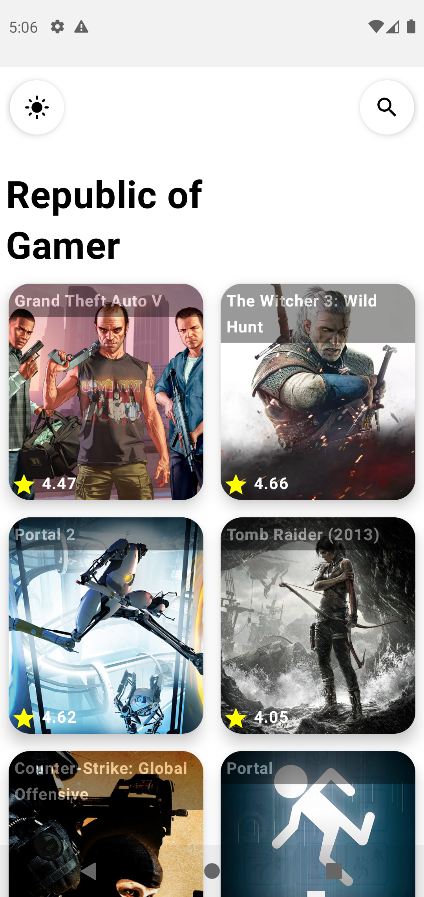
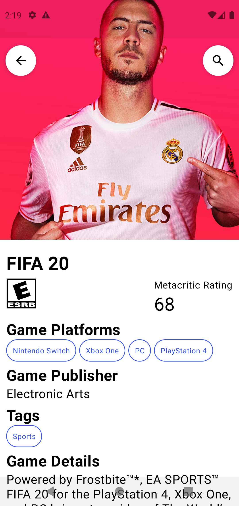
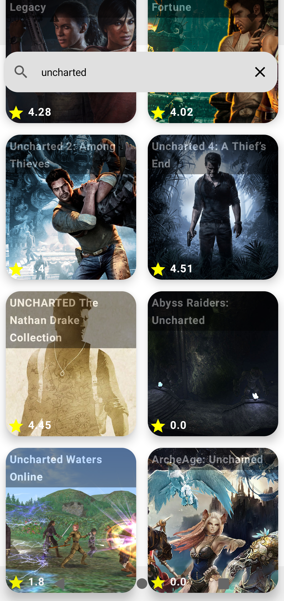
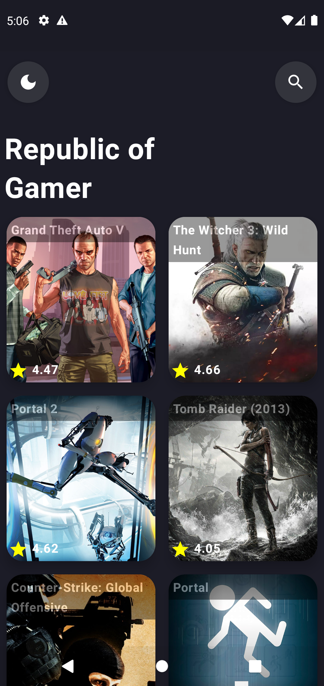
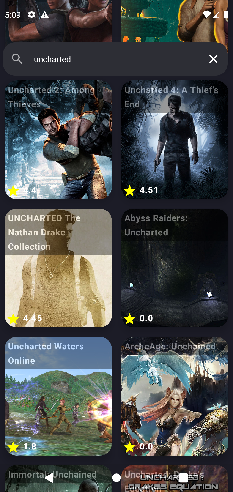

# Kinetic

Kinetic is A games details App Built with Jetpack Compose using the Rawg API. The app follows mvvm clean architecture design pattern

## App Link
https://drive.google.com/file/d/1CMMjTHgJH_zJH4se4eTg5CTda5tVJl38/view?usp=sharing

## **Screenshots**

- #### Light Mode
&emsp;
&emsp;
&emsp;


- #### Dark Mode
&emsp;
&emsp;
&emsp;


## Architecture


### 1.UI layer
The role of the UI layer (or presentation layer) is to display the application data on the screen. Whenever the data changes, either due to user interaction (such as pressing a button) or external input (such as a network response), the UI should update to reflect the changes.
The UI layer is made up of two things:

* UI elements that render the data on the screen. You build these elements using Views or Jetpack Compose functions.
* State holders (such as ViewModel classes) that hold data, expose it to the UI, and handle logic.

### 2.Data layer
The data layer of an app contains the business logic. The business logic is what gives value to your app—it's made of rules that determine how your app creates, stores, and changes data.
The data layer is made of repositories that each can contain zero to many data sources. You should create a repository class for each different type of data you handle in your app.

### 3.Domain Layer
The domain layer is an optional layer that sits between the UI and data layers.
The domain layer is responsible for encapsulating complex business logic, or simple business logic that is reused by multiple ViewModels. This layer is optional because not all apps will have these requirements. You should use it only when needed—for example, to handle complexity or favor reusability

## Tech Stack
 - [Kotlin](https://kotlinlang.org/docs/reference/) - Kotlin is a cross-platform, statically typed, general-purpose programming language with type inference. Kotlin is designed to interoperate fully with Java, and the JVM version of Kotlin's standard library depends on the Java Class Library, but type inference allows its syntax to be more concise
 
 * [Jetpack Components:](https://developer.android.com/topic/architecture?gclid=Cj0KCQjw8O-VBhCpARIsACMvVLOH1satX45o9f4PMQ4Sxr7bG9myl6-KZL9nYda8PJsHV7m2uJL8bzgaAmqiEALw_wcB&gclsrc=aw.ds)
    * [Jetpack Compose](https://developer.android.com/jetpack/compose?gclid=Cj0KCQjwhqaVBhCxARIsAHK1tiMMwHsxQ8Z25jyEdtLha9erq11wROoEfL6RqpGMprgbDTNuMO3_Ri8aAu5EEALw_wcB&gclsrc=aw.ds) -  Android’s modern toolkit for building native UI. It simplifies and accelerates UI development on Android
    * [View Model](https://developer.android.com/topic/libraries/architecture/viewmodel)-  store and manage UI-related data in a lifecycle conscious way.
    * [Lifecycle]( https://developer.android.com/topic/libraries/architecture/lifecycle) - Perform actions in response to a change in the lifecycle status of another component, such as activities and fragments.
    * [Android KTX](https://developer.android.com/kotlin/ktx.html) - Android KTX is a set of Kotlin extensions that are included with Android Jetpack and other Android libraries. KTX extensions provide concise, idiomatic Kotlin to Jetpack, Android platform, and other APIs.

- [Ktor](https://github.com/ktorio/ktor)- Ktor is an asynchronous framework for creating microservices, web applications and more. Written in Kotlin from the ground up.

* [Dagger-Hilt](https://dagger.dev/hilt/)- a dependency injection library for Android that reduces the boilerplate of doing manual dependency injection in your project

* [Coroutines](https://developer.android.com/kotlin/coroutines) - a concurrency design pattern that you can use on Android to simplify code that executes asynchronously
* [Flow](https://developer.android.com/kotlin/flow)- In coroutines, a flow is a type that can emit multiple values sequentially, as opposed to suspend functions that return only a single value.
* [Coil](https://coil-kt.github.io/coil/compose/) - Image Loader library.
* [Lottie](https://github.com/airbnb/lottie-android) - Lottie is a mobile library for Android and iOS that parses Adobe After Effects animations exported as json with Bodymovin and renders them natively on mobile!

## Data Source
This application fetches its data from the [Rawg](https://rawg.io). Find the Documentation by following this [link](https://rawg.io/apidocs).

## Author
Benjamin Muthui

<a href="https://www.buymeacoffee.com/benjahjp" target="_blank"></a>
  
  
  ## License and Copyright

[MIT LICENSE](LICENSE)
  
  ```
  MIT License

Copyright (c) 2023 Benjamin Muthui

Permission is hereby granted, free of charge, to any person obtaining a copy
of this software and associated documentation files (the "Software"), to deal
in the Software without restriction, including without limitation the rights
to use, copy, modify, merge, publish, distribute, sublicense, and/or sell
copies of the Software, and to permit persons to whom the Software is
furnished to do so, subject to the following conditions:

The above copyright notice and this permission notice shall be included in all
copies or substantial portions of the Software.

THE SOFTWARE IS PROVIDED "AS IS", WITHOUT WARRANTY OF ANY KIND, EXPRESS OR
IMPLIED, INCLUDING BUT NOT LIMITED TO THE WARRANTIES OF MERCHANTABILITY,
FITNESS FOR A PARTICULAR PURPOSE AND NONINFRINGEMENT. IN NO EVENT SHALL THE
AUTHORS OR COPYRIGHT HOLDERS BE LIABLE FOR ANY CLAIM, DAMAGES OR OTHER
LIABILITY, WHETHER IN AN ACTION OF CONTRACT, TORT OR OTHERWISE, ARISING FROM,
OUT OF OR IN CONNECTION WITH THE SOFTWARE OR THE USE OR OTHER DEALINGS IN THE
SOFTWARE.
  
  ```
